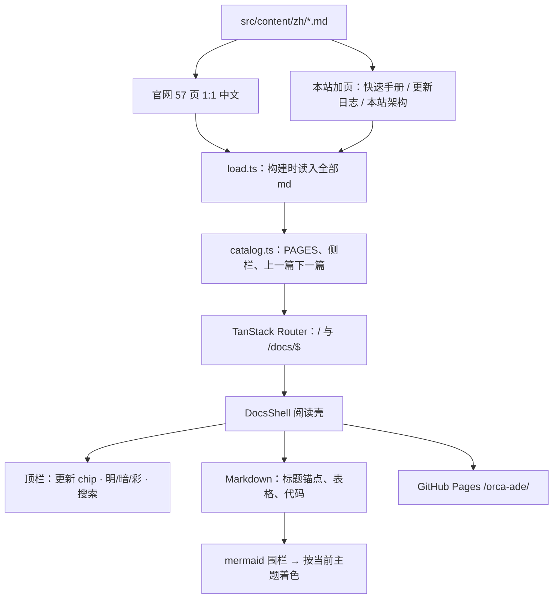
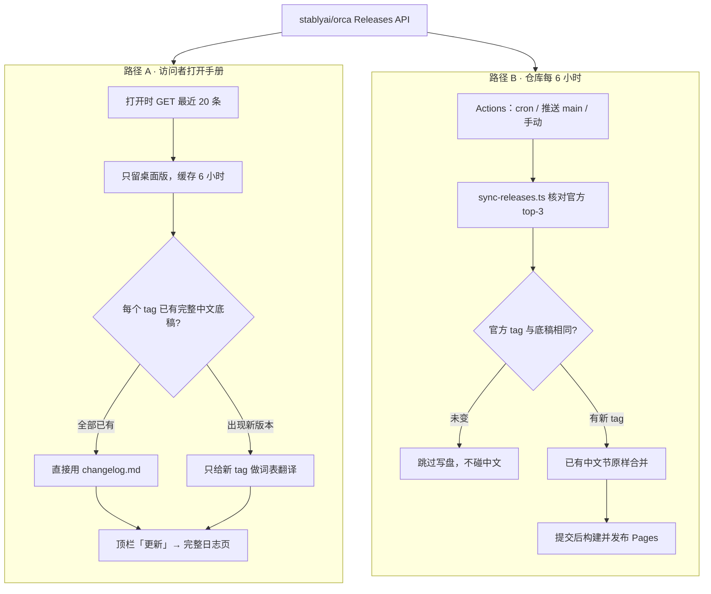

# 本站架构 {#architecture}

这份中文手册自己怎么组成、正文怎么变成页面，以及更新日志怎么跟着官方 Release 走。**不是** Orca ADE 产品架构。

命令、产品名、文件名保持英文。官网 57 页仍是 1:1 译本；本页和 [快速手册](/docs/quick-guide)、[更新日志](/docs/changelog) 一样，是本站加页。

## 手册框架图 {#site-map}

源文件全部在 `src/content/zh/`。构建时一次性读入，侧栏按 `catalog.ts` 排，路由只有 `/` 和 `/docs/$` 两层。顶栏的「更新」、明/暗/彩、搜索都挂在同一层壳上。

| 层 | 职责 | 关键文件 |
| --- | --- | --- |
| 源文件 | 一页一个 md；官网页保留英文 `{#id}` 锚点 | `src/content/zh/` |
| 目录 | 标题、简介、侧栏顺序、邻居页 | `src/lib/docs/catalog.ts` |
| 加载 | 构建时 glob `**/*.md?raw`，按 slug 取正文 | `src/lib/docs/load.ts` |
| 路由 | `/` 首页，`/docs/quick-guide` 这类走 splat | `src/routes/index.tsx`、`docs.$.tsx` |
| 壳 | 顶栏、侧栏、TOC、更新状态行 | `src/components/docs/DocsShell.tsx` |
| 正文 | 解析 md；`mermaid` 围栏单独画图 | `Markdown.tsx`、`MermaidBlock.tsx` |
| 发布 | SPA 静态站，base 为 `/orca-ade/` | GitHub Pages 工作流 |

侧栏「从这里开始」的顺序是：快速手册 → 更新日志 → 本站架构 → 官网首页译本。后面的 57 页与 [onorca.dev/docs](https://www.onorca.dev/docs) 目录对齐。

## 数据更新驱动图 {#data-drive}

顶栏「更新」只展示最近三次桌面版的**核心摘要**；点进去打开 [完整中文日志](/docs/changelog)，不是 GitHub 英文页。

两条路径共用同一个官方源：`stablyai/orca` 的 GitHub Releases。浏览器负责打开时刷新；仓库 Actions 负责把底稿写进 git，这样没连上官方源时仍能读到中文。

| 路径 | 何时跑 | 写出什么 | 明确不做什么 |
| --- | --- | --- | --- |
| 访问者浏览器 | 打开手册、缓存超过 6 小时 | 内存快照 + `localStorage` | 不改仓库、不调用翻译模型 |
| GitHub Actions | 每 6 小时，或 `main` 推送 | `releases.ts` 摘要 + `changelog.md` | tag 未变不写盘；已有 `## vX.Y.Z` 中文节不覆盖 |
| 词表翻译 | 只有**新出现**的桌面版 tag | 标题、类型前缀、常见短语 | 不重写已人工校对的版本 |

过滤规则（两条路径相同）：丢掉 `draft` / `prerelease`，丢掉 tag 或名称里带 android / mobile / ios 的条目，只保留 `v主.次.补` 这种桌面版。

## 读图要点 {#how-to-read}

- **中文底稿优先。** 只要 `changelog.md` 里已有对应 `## v1.4.199` 这类章节，在线抓取也继续用那一节。这就是 v1.4.199 不会在部署后变回英文的原因。
- **顶栏不是下拉英文。** chip 上是最新 tag 和三句摘要的入口；完整段落在 [更新日志](/docs/changelog) 本页。
- **访问者路径不花钱。** 浏览器直接问 GitHub REST（无自定义头，避免 CORS 预检）。质量更高的人工/模型译本只在底稿里，不会在每次打开页面时再跑一遍。
- **明 / 暗 / 彩** 只换 CSS 变量。本页两张图跟当前主题走，切换风格后会按新的 `--app-*` 重绘。

想从日常用法进手册，仍从 [快速手册](/docs/quick-guide) 开始；想对官方某一页，走侧栏里与官网同名的章节。
